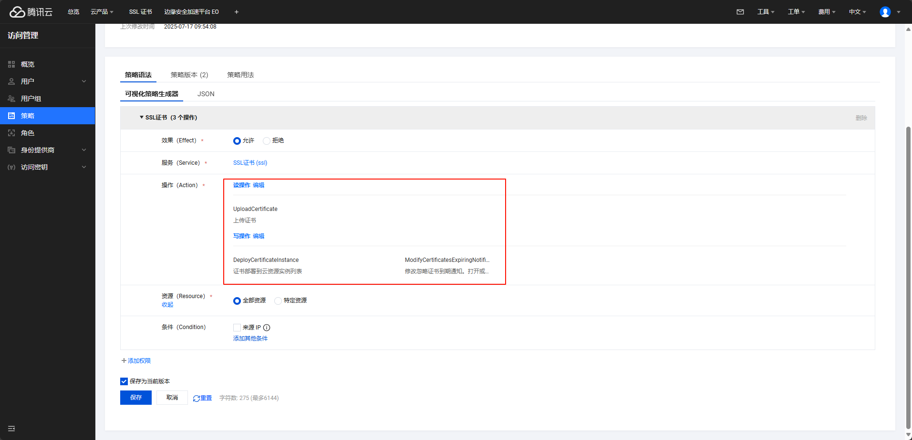

# tc-eo-ssl
腾讯云自动上传 SSL 证书并部署到边缘安全加速平台 EO

# 如何使用
## 获取API密钥
！！！！！！一定要创建一个子用户，并给最小权限，不要使用直接使用主账号的密钥！！！！！！

第一步，快速创建一个子用户 [https://console.tencentcloud.com/cam/user/create?systemType=FastCreateV2](https://console.tencentcloud.com/cam/user/create?systemType=FastCreateV2)

创建完成记住子用户的 SecretId 和 SecretKey

第二步，先在腾讯云控制台创建一个用户策略，并授权给子用户 [https://console.tencentcloud.com/cam/policy](https://console.tencentcloud.com/cam/policy)




## 使用
该程序支持环境变量参数，以及命令行参数，命令行参数优先级高于环境变量，程序支持 docker，推荐使用，示例：
先创建一个 `docker-compose.yml` 文件，内容如下：
```yaml
services:
  tc-eo-ssl:
    image: npcdw/tc-eo-ssl
    container_name: tc-eo-ssl
    volumes:
      - ../acme/ssl/:/ssl/"
    environment:
      TZ: 'Asia/Shanghai'
      LANG: 'C.UTF-8'
      LC_ALL: 'C.UTF-8'
      TENCENTCLOUD_SECRET_ID: 'your secret id'
      TENCENTCLOUD_SECRET_KEY: 'your secret key'
      TENCENTCLOUD_PUBLIC_KEY_FILE_PATH: '/ssl/example.com/example.com.pem'
      TENCENTCLOUD_PRIVATE_KEY_FILE_PATH: '/ssl/example.com/example.com.key'
      TENCENTCLOUD_INSTANCE_ID_LIST: 'app.example.com,www.example.com,*.example.com'
      TENCENTCLOUD_INTL: 'true'
```
然后执行 `docker compose up` 启动并查看日志，程序执行成功自动退出，请到腾讯云控制台确认证书被正确上传以及部署，证书上传成功会立即在证书控制台看见，但部署是异步任务，需要等待几分钟才会开始。

如果一切无误，下次上传部署证书时只需要执行 `docker restart tc-eo-ssl` 即可。
推荐配合 `acme.sh` 使用，修改安装证书后重载命令
```bash
acme.sh --install-cert -d DOMAIN --key-file example.com.key --fullchain-file example.com.pem --reloadcmd "docker restart tc-eo-ssl"
```